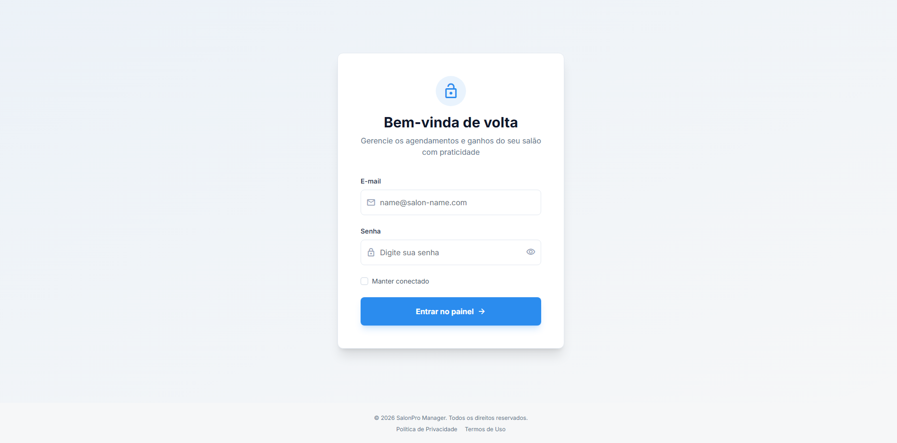
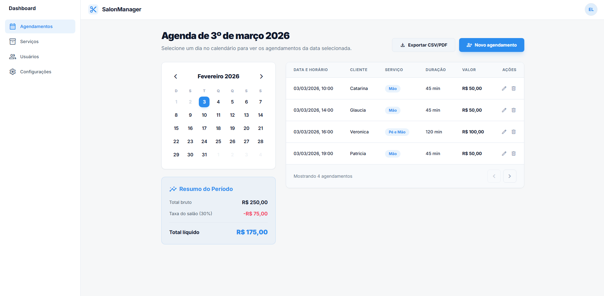
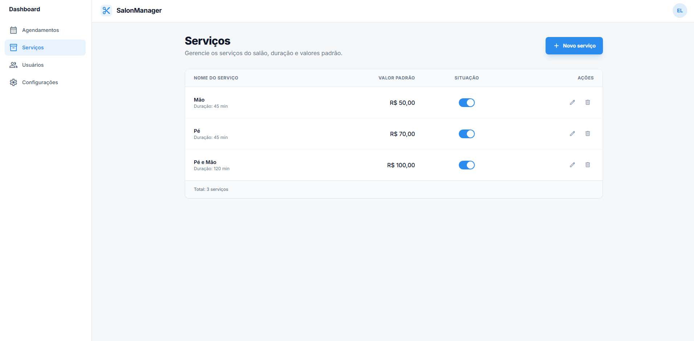
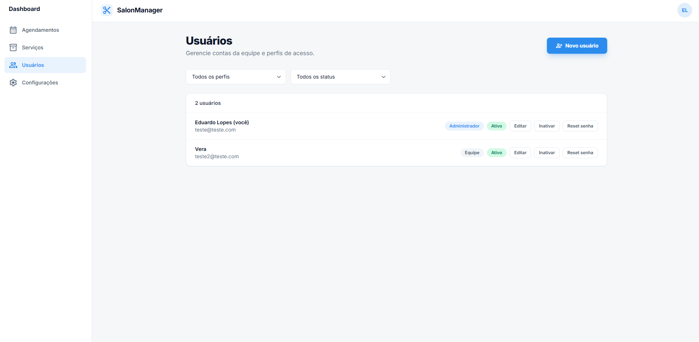
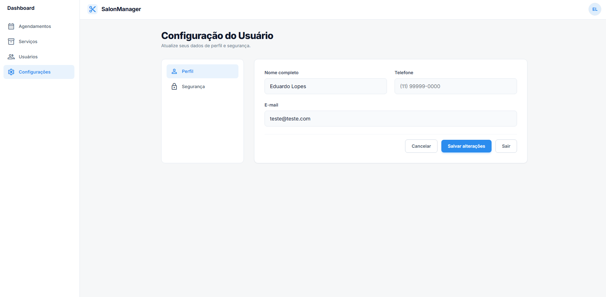

# SalonManager React + Node

Sistema de gestão para salão com:

- Frontend: React + Vite
- Backend: Node.js + Express
- Banco local: SQLite (arquivo local)

## Requisitos

- Node.js 18+
- npm 9+
- Docker (opcional)

## 1) Subir rápido em ambiente local

### Instalar dependências

```bash
npm install
npm --prefix backend install
```

### Iniciar backend (terminal 1)

```bash
npm run dev:api
```

### Iniciar frontend (terminal 2)

```bash
npm run dev
```

### URLs

- Frontend: `http://localhost:5173`
- API: `http://localhost:4000`
- Health check: `http://localhost:4000/health`

## 2) Subir com Docker Compose

```bash
docker compose up
```

URLs:

- Frontend: `http://localhost:5173`
- API: `http://localhost:4000`
- Health check: `http://localhost:4000/health`

Parar containers:

```bash
docker compose down
```

## Telas e funcionalidades

Use a pasta `docs/screens/` para salvar as imagens com os nomes abaixo.

### Login

- Autenticação por e-mail e senha.
- Redirecionamento para troca de senha quando `mustChangePassword=true`.

Imagem:



### Agendamentos

- Calendário mensal com seleção de dia.
- Listagem de agendamentos do dia selecionado.
- Criação, edição e remoção de agendamentos.
- Exportação de dados (CSV/PDF).

Imagem:



### Serviços

- Cadastro de serviços.
- Edição e inativação de serviços.
- Serviços ativos disponíveis para novos agendamentos.

Imagem:



### Usuários (admin)

- Listagem de usuários do sistema.
- Criação e edição de usuários (somente admin).
- Ativação/inativação de contas.
- Reset de senha por admin.

Imagem:



### Configurações do usuário

- Edição de dados do perfil.
- Alteração de senha do usuário autenticado.

Imagem:




## Primeira configuração de acesso (admin)

Este sistema não tem auto-cadastro público.  
O primeiro admin deve ser criado via CLI.

```bash
npm run admin:create
```

Para reset de senha de admin:

```bash
npm run admin:reset-password -- --email admin@salon.com
```

Detalhes de flags (`--force`, `--auto-password`, `--password`, `--name`) no [backend/README.md](backend/README.md).

## Scripts úteis (raiz)

- `npm run dev`: frontend em desenvolvimento
- `npm run dev:api`: backend em watch
- `npm run start:api`: backend sem watch
- `npm run build`: build do frontend
- `npm run admin:create`: cria admin via CLI
- `npm run admin:reset-password -- --email ...`: reset de senha de admin via CLI

## Banco de dados (SQLite)

- Arquivo padrão: `backend/data/app.db`
- O arquivo é criado automaticamente ao iniciar o backend, se não existir.
- Para resetar ambiente local:
  - pare a API;
  - remova `backend/data/app.db` (e `.db-wal`/`.db-shm` se existirem);
  - inicie novamente.

## Solução de problemas

### API não responde em `localhost:4000`

- local: confirme que o backend está rodando (`npm run dev:api`);
- Docker: confirme `HOST=0.0.0.0` no `docker-compose.yml`;
- veja logs:

```bash
docker compose logs -f api
```

### Erro `attempt to write a readonly database`

- causa comum: arquivo `backend/data/app.db` criado como `root` por container;
- o `docker-compose.yml` já roda com `user: "${UID:-1000}:${GID:-1000}"` para evitar isso;
- se já aconteceu, apague os arquivos de banco e suba novamente:

```bash
rm -f backend/data/app.db backend/data/app.db-shm backend/data/app.db-wal
```

### Frontend não autentica

- confira `CORS_ORIGIN` no backend (deve incluir `http://localhost:5173` e `http://127.0.0.1:5173`);
- confira se backend está acessível em `http://localhost:4000/health`.

## Estrutura do projeto

- `src/`: frontend
- `backend/src/`: API
- `backend/tests/`: testes da API
- `backend/data/`: banco SQLite local

## Documentação da API

Detalhes de endpoints, regras e contratos em [backend/README.md](backend/README.md).
